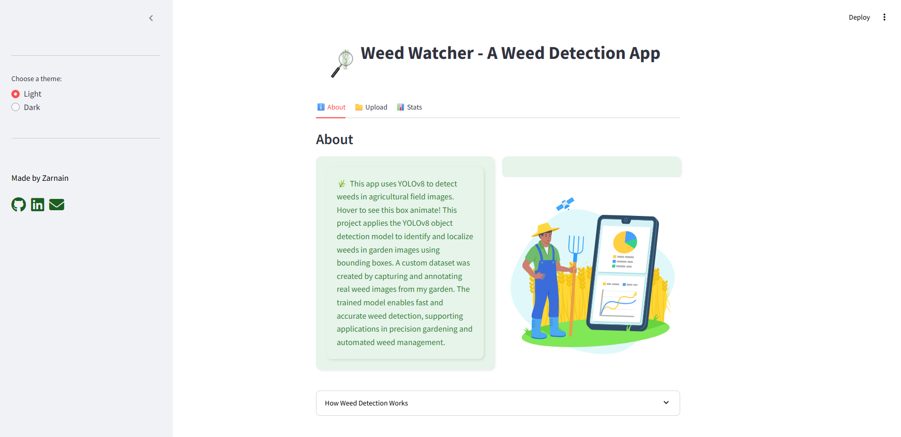
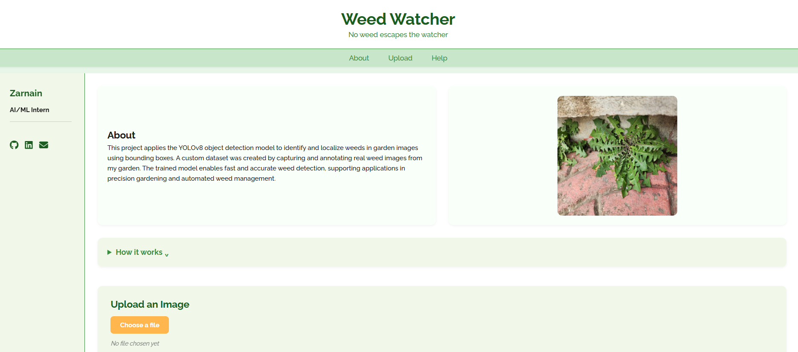

# 🌱 Weed Watcher – A Weed Detection App  

  
  
  
  

Weed Watcher is a computer vision project built to **detect weeds in garden and farm images**.  
It provides a simple platform where you can upload an image, and the app will automatically identify weeds (unwanted plants) by drawing **bounding boxes** around them.  

The dataset used in this project was **collected locally in Srinagar, Kashmir**, where I captured, labeled, and augmented weed images. The model was trained using **YOLOv8l**, and two user interfaces were developed:  
- A **Streamlit app** for quick experimentation and testing.  
- A **FastAPI + HTML/CSS/JS app** for a web-based frontend and backend separation.  

---

##  Table of Contents
1. [Features](#-features)
2. [Tech Stack](#tech-stack)
3. [Dataset](#dataset)
4. [Project Structure](#project-structure)
5. [Installation & Setup](#-installation--setup)
6. [Running the App](#running-the-app)
7. [Usage](#usage)
8. [Screenshots](#-screenshots)
9. [Future Work](#future-work)
10. [Acknowledgments](#acknowledgments)

---

##  Features
- Weed detection using **YOLOv8l**.
- Two UIs:  
  - **Streamlit App** → quick demo with adjustable confidence threshold (0–100%).  
  - **FastAPI + Web UI** → HTML/CSS/JS frontend powered by FastAPI backend.  
- **Bounding boxes** and **weed count** in output. 
- Locally collected dataset from gardens in Srinagar, Kashmir.  
- Evaluation metrics: Precision, Recall, mAP.  

---

## Tech Stack
- **Model**: YOLOv8l (Ultralytics)  
- **Languages**: Python, JavaScript  
- **Frameworks**: Streamlit, FastAPI  
- **Frontend**: HTML, CSS, JavaScript  
- **Libraries**: PyTorch, OpenCV, NumPy, Pandas, Ultralytics  

---

## Dataset
- **Collected locally** in Srinagar, Kashmir (~330 raw images).  
- Images labeled in **Label Studio**.  
- **Data augmentation** performed using **Roboflow** → expanded dataset to ~650 images.  
- Final YOLO dataset split:  
  - `train/` → 579 images  
  - `val/` → 22 images  
  - `test/` → 23 images  
- **Classes**:  
  - `weed` (single class).  

*Note:* Some additional garden images (not part of train/val/test) were used later for performance testing.  

---

## Project Structure
```text
weed-detection-app/
├── backend/          # FastAPI backend code
├── dataset/          # YOLO dataset (train/val/test)
├── frontend/         # HTML, CSS, JS files
├── streamlit_app/    # Streamlit app code
├── zenv/             # Virtual environment
├── requirements.txt  # Dependencies
└── README.md         # Project documentation
```
---

##  Installation & Setup

### 1. Clone Repository
```bash
git clone https://github.com/your-username/weed-watcher.git
cd weed-watcher
```

### 2. Create Virtual Environment
```powershell
python -m venv zenv
.\zenv\Scripts\activate
```

### 3. Install Requirements
Project dependencies are listed in `requirements.txt`.  
After activating the virtual environment, install them with:

```powershell
pip install -r requirements.txt
```
Some of the main dependencies include:
- `fastapi`
- `uvicorn`
- `python-multipart`
- `ultralytics`

---

## Running the App:

### 1. Streamlit Interface
```bash
cd streamlit_app
streamlit run streamlit_app.py
```

### 2. FastAPI + Web Interface
```powershell
.\zenv\Scripts\Activate.ps1
uvicorn backend.main:app --reload
```
Then open frontend/index.html in a browser.

---

## Usage
- **Upload an image** of a garden/farm area.
- The model predicts weeds and marks them with bounding boxes.
- In Streamlit:
  - Adjust **confidence threshold** (default = 0.5)
  - See **weed count** and **detection results**


---

## 📸 Screenshots  

### Streamlit Interface  
  

### FastAPI Web Interface  
  

---

## Future Work
- Containerization using **Docker**
- Deploying the app to cloud (**AWS/GCP**)
- Mobile-friendly interface

---

## Acknowledgments
- **Dataset:** Collected, labeled, and augmented by me in Srinagar, Kashmir.
- **Frameworks:** Ultralytics YOLOv8, Streamlit, FastAPI
